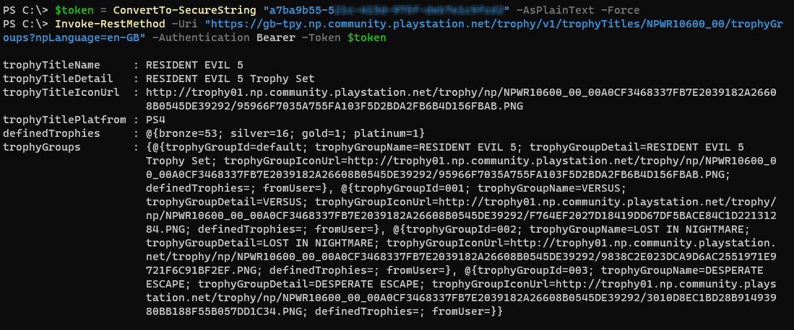
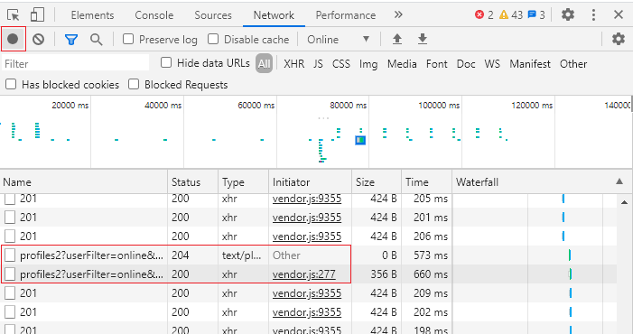
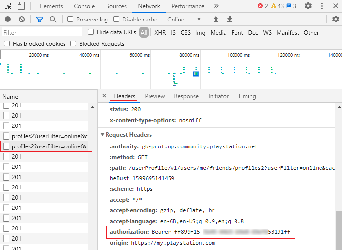

# PlayStation Trophies API

Sony has an API for retrieving details of the trophies an account has earned, but there is no public documentation for using it. This is an attempt at documenting the API by capturing the requests made by the https://my.playstation.com web site when browsing the trophy data of a PSN account.

## Overview
* Accessing the API requires authentication with a PSN account.
* The trophy details returned will by default be that of the authenticating PSN account.
* You can return the details of another PSN account providing the authenticating PSN account has permission to view the other users trophy list (utilised by the Compare with User function of the web site).
* The API has a rate limit of ~300 requests per 15 minutes.

#   API Documentation

The base URL for accessing this API is: https://gb-tpy.np.community.playstation.net

There are three core API URLs which you will need to make a request to in order to be able to retrieve the trophy details of a user. 

1. A request to retrieve the list of titles (games) for which the user has earned trophies.
2. A request to retrieve the groups of trophies that may belong to the title.
3. A request to retrieve the trophies which belong to the title.

Successful requests to the API will return a JSON response. These URLs, the inputs they require and the response they return are detailed below.

?> **Note** the URL begins with a regional reference `gb`. This can be changed to utilise servers in a specific region. It is unclear if there is any benefit to targeting a specific server other than for ensuring you are communicating with a server geographically close to you. All examples in this documentation will utilise the "gb" URL.

**Other Examples**<br>
https://de-tpy.np.community.playstation.net<br>
https://us-tpy.np.community.playstation.net<br>
https://jp-tpy.np.community.playstation.net<br>

## 1. Retrieve the Trophy Titles

    https://gb-tpy.np.community.playstation.net/trophy/v1/trophyTitles

Requests to this URL will retrieve a list of the titles, and a summary of trophies earned from them, for the authenticating PSN account. Additionally it will tell you the total number of titles associated with the account. This information is important as there is a limit to the number of titles that can be returned in a single request and so if you want to retrieve the complete list of a titles for an account you can use this total number of titles and the offset parameter to iterate through all titles.

Included in the information returned is the titles unique `npCommunicationId`. This is required to make use of the subsequent URLs for requesting more specific detail about a titles trophies.

The results are presented in order of the `lastUpdateDate` for the title, so the first result will be the title from which you most recently earned a trophy _(or synced for the first time in the case of a game with 0% progress)_.

### Input Parameters

| Parameter | Type | Example Value | Description | Required |
| --- | --- | --- | --- | --- |
| npLanguage | String | `en-GB`<br>`de` | Response will utilise this language code | Yes
| platform | String | `PS4,PS3,PSVITA`<br>`PS4`<br>`PS4,PSVITA` | Limit title data to these platform(s) | Yes |
| limit | Numeric<br>**Min** 1<br>**Max** 128<br>**Default** 128 | `1` | Limit title data to this number of results | No |
| offset | Numeric<br>**Min** 0<br>**Max** `$totalResults`- 1<br>**Default** 0 | `50` | Returns title data from this result onwards | No |
| comparedUser | String | `another-PSN-user` | Returns title data of another PSN account in addition to that of the authenticating PSN account | No |

### Output JSON Response

| Attribute | Type | Example Value | Description |
| --- | --- |--- | --- | 
| totalResults | Numeric | `300` | Total number of trophy titles for this account <br> **Note** when `comparedUser` is used this is the total number of titles earned by both the authenticating and compared user account. Games which both accounts have played are only counted once
| offset | Numeric | `0` | The offset that was supplied in the request
| limit | Numeric | `128` | Number of titles that were returned
| trophyTitles | [JSON object](/#trophytitles-json-objects) | | Individual object for each title returned

##### trophyTitles JSON objects <!-- {docsify-ignore} -->

| Attribute | Type | Example Response | Description |
| --- | --- |--- | --- |
|npCommunicationId| String | `NPWR10600_00` | Unique ID of the title; later required for requesting detailed trophy information for this title
| trophyTitleName | String | `RESIDENT EVIL 5` | Title name
| trophyTitleDetail | String | `RESIDENT EVIL 5 Trophy Set` | Title description
| trophyTitleIconUrl | String | `http://...` | URL of the Icon for the trophy title
| trophyTitlePlatfrom | String | `PS4` | The platform this title belongs to. Some games have trophy sets which are shared between multiple platforms (ie. PS4,PSVITA). The platforms will be comma separated.
| hasTrophyGroups | Boolean | `true` | true if the title has multiple groups of trophies (eg. DLC trophies which are separate from the main trophy list)
| definedTrophies | [JSON object](/#definedtrophies-json-objects) | | Number of trophies for the title by type
| fromUser | [JSON object](/#fromuser-and-compareduser-json-object) | | Title summary for the PSN account used for authentication
| comparedUser | [JSON object](/#fromuser-and-compareduser-json-object) | | Title summary for another user

##### definedTrophies JSON objects <!-- {docsify-ignore} -->

| Attribute | Type | Example Value | Description |
| --- | --- |--- | --- | 
| bronze | Numeric | `53` | Total bronze trophies from all trophy groups
| silver | Numeric | `16` | Total silver trophies from all trophy groups
| gold | Numeric | `1` | Total gold trophies from all trophy groups
| platinum | Numeric | `1` | Total platinum trophies from all trophy groups

##### fromUser and comparedUser JSON object <!-- {docsify-ignore} -->
`fromUser` is the PSN account used for authentication<br>
`comparedUser` is another PSN account for which you are querying trophy data

| Attribute | Type | Example Value | Description |
| --- | --- |--- | --- | 
| onlineId | String | `PSN-username` | Username of the PSN account
| progress | Numeric | `50` | Percentage of trophies earned for the title
| earnedTrophies | [JSON object](/#earnedtrophies-json-object) | | Summary of the trophies earned for the title (by type)
| hiddenFlag | String | `False` | Title has been hidden from trophy list **(fromUser only)**
| lastUpdateDate | Date (UTC) | `02/09/2017 22:14:52` | Date most recent trophy earned for the title

##### earnedTrophies JSON object <!-- {docsify-ignore} -->

| Attribute | Type | Example Value | Description |
| --- | --- |--- | --- | 
| bronze | Numeric | `40` | Total bronze trophies earned from all trophy groups
| silver | Numeric | `11` | Total silver trophies earned from all trophy groups
| gold | Numeric | `1` | Total gold trophies earned from all trophy groups
| platinum | Numeric | `1` | Total platinum trophies earned from all trophy groups

### Example URLs and Responses

##### Example 1 <!-- {docsify-ignore} -->
**Retrieve up to the first 128 titles from PS4, PS3 or PSVITA**

    https://gb-tpy.np.community.playstation.net/trophy/v1/trophyTitles?npLanguage=en-GB&platform=PS4,PS3,PSVITA

```json
{
  "totalResults": 570,
  "offset": 0,
  "limit": 128,
  "trophyTitles": [
    {
      "npCommunicationId": "NPWR19418_00",
      "trophyTitleName": "Fall Guys",
      "trophyTitleDetail": "Fall Guys",
      "trophyTitleIconUrl": "http://trophy01.np.community.playstation.net/trophy/np/NPWR19418_00_00DD64BDB8FDDEC62DE6E561F32D6232100339A04A/4E1DE7EDED859551704FF395BA37CADEB296E48D.PNG",
      "trophyTitlePlatfrom": "PS4",
      "hasTrophyGroups": false,
      "definedTrophies": {
        "bronze": 21,
        "silver": 8,
        "gold": 5,
        "platinum": 1
      },
      "fromUser": {
        "onlineId": "PSN-username",
        "progress": 91,
        "earnedTrophies": {
          "bronze": 21,
          "silver": 8,
          "gold": 4,
          "platinum": 0
        },
        "hiddenFlag": false,
        "lastUpdateDate": "2020-09-05T11:50:53Z"
      }
    },
    {
      "npCommunicationId": "NPWR18347_00",
      "trophyTitleName": "Project CARS 3",
      "trophyTitleDetail": "Trophy Collection for Project CARS 3",
      "trophyTitleIconUrl": "http://trophy01.np.community.playstation.net/trophy/np/NPWR18347_00_00F1EBC5CD722A3D409BF05D0769A846C26EA5BA5C/21DEC3F7CE3E1E8DDF49D0C23856AD997F16D05B.PNG",
      "trophyTitlePlatfrom": "PS4",
      "hasTrophyGroups": false,
      "definedTrophies": {
        "bronze": 14,
        "silver": 19,
        "gold": 3,
        "platinum": 1
      },
      "fromUser": {
        "onlineId": "PSN-username",
        "progress": 44,
        "earnedTrophies": {
          "bronze": 9,
          "silver": 8,
          "gold": 1,
          "platinum": 0
        },
        "hiddenFlag": false,
        "lastUpdateDate": "2020-09-04T10:30:19Z"
      }
    },
...
... truncated
```
##### Example 2 <!-- {docsify-ignore} -->
**Retrieve up to 50 titles from PS4 starting at title 150**

    https://gb-tpy.np.community.playstation.net/trophy/v1/trophyTitles?npLanguage=en-GB&platform=PS4&offset=149&limit=50`

```json
{
  "totalResults": 342,
  "offset": 149,
  "limit": 50,
  "trophyTitles": [
    {
      "npCommunicationId": "NPWR12476_00",
      "trophyTitleName": "Crash Bandicoot",
      "trophyTitleDetail": "Crash Bandicoot",
      "trophyTitleIconUrl": "http://trophy01.np.community.playstation.net/trophy/np/NPWR12476_00_00E1AF50FB3CB9DF4438C2BCF096EDB614FA7511DB/F787409C58420CD25FC87DD5EE5B34BFBDA7835A.PNG",
      "trophyTitlePlatfrom": "PS4",
      "hasTrophyGroups": true,
      "definedTrophies": {
        "bronze": 8,
        "silver": 8,
        "gold": 8,
        "platinum": 1
      },
      "fromUser": {
        "onlineId": "PSN-username",
        "progress": 68,
        "earnedTrophies": {
          "bronze": 7,
          "silver": 6,
          "gold": 5,
          "platinum": 0
        },
        "hiddenFlag": false,
        "lastUpdateDate": "2017-07-09T15:16:12Z"
      }
    },
...
... truncated
```

## 2. Retrieve the Trophy Groups for a Title

    https://gb-tpy.np.community.playstation.net/trophy/v1/trophyTitles/{npCommunicationId}/trophyGroups

A title may have additional groups of trophies. This is most commonly seen in games which have expansions where additional trophies are added.

All titles have a `default` group. Titles which have additional groups will have groups named `001` incrementing for each additional group.

You can make a request to this URL for a specific title - using the unique `npCommunicationId` for the title - and in response will receive a summary of all of the trophy groups associated with the title. This also includes a summary of the number of trophies for the title broken down by group and type (gold, silver etc.)

### Input Parameters

| Parameter | Type | Example Value | Description | Required |
| --- | --- | --- | --- | --- |
|npCommunicationId| String | `NPWR10600_00` | Unique ID of the title | Yes
|npLanguage| String |`en-GB`<br>`de`|Trophy description language code| Yes

### Output JSON Response

| Attribute | Type | Example Value | Description |
| --- | --- |--- | --- | 
| trophyTitleName | String | `RESIDENT EVIL 5` | Title name
| trophyTitleDetail | String | `RESIDENT EVIL 5 Trophy Set` | Title description
| trophyTitleIconUrl | String | `http://...` | URL of the Icon for the trophy title
| trophyTitlePlatfrom | String | `PS4` | The platform this title belongs to. Some games have trophy sets which are shared between multiple platforms (ie. PS4,PSVITA). The platforms will be comma seperated.
| definedTrophies | [JSON object](/#definedtrophies-json-object) | | Number of trophies for the title by type
| trophyGroups | [JSON object](/#trophygroups-json-objects) | | Individual object for each trophy group returned

##### definedTrophies JSON object <!-- {docsify-ignore} -->

| Attribute | Type | Example Value | Description |
| --- | --- |--- | --- | 
| bronze | Numeric | `53` | Total bronze trophies from all trophy groups
| silver | Numeric | `16` | Total silver trophies from all trophy groups
| gold | Numeric | `1` | Total gold trophies from all trophy groups
| platinum | Numeric | `1` | Total platinum trophies from all trophy groups

##### trophyGroups JSON objects <!-- {docsify-ignore} -->

| Attribute | Type | Example Value | Description |
| --- | --- |--- | --- | 
| trophyGroupId | String | `default`<br>`001` | ID for the trophy group (all titles have default, additional groups are 001 incrementing)
| trophyGroupName | String | `RESIDENT EVIL 5` | Trophy group name
| trophyGroupDetail | String | `RESIDENT EVIL 5 Trophy Set` | Trophy group description
| trophyGroupIconUrl | String | `https://...` | URL of the Icon for the trophy group
| definedTrophies | [JSON object](/#definedtrophies-json-object-1) | | Number of trophies for the trophy group by type
| fromUser | [JSON object](/#fromuser-and-compareduser-json-object-1) | | Trophy group summary for the PSN account used for authentication
| comparedUser | [JSON object](/#fromuser-and-compareduser-json-object-1) | | Trophy group summary for another user

##### definedTrophies JSON object <!-- {docsify-ignore} -->

| Attribute | Type | Example Value | Description |
| --- | --- |--- | --- | 
| bronze | Numeric | `38` | Total bronze trophies in the trophy group
| silver | Numeric | `11` | Total silver trophies in the trophy group
| gold | Numeric | `1` | Total gold trophies in the trophy group
| platinum | Numeric | `1` | Total platinum trophies in the trophy group

##### fromUser and comparedUser JSON object <!-- {docsify-ignore} -->
`fromUser` is the PSN account used for authentication<br>
`comparedUser` is another PSN account for which you are querying trophy data

| Attribute | Type | Example Value | Description |
| --- | --- |--- | --- | 
| onlineId | String | `PSN-username` | Username of the PSN account
| progress | Numeric | `100` | Percentage of trophies earned in the trophy group
| earnedTrophies | [JSON object](/#earnedtrophies-json-object-1) | | Summary of the trophies earned in the trophy group
| hiddenFlag | String | `False` | Title has been hidden from trophy list **(fromUser only)**
| lastUpdateDate | Date (UTC) | `02/09/2017 22:14:52` | Date most recent trophy earned for the title

##### earnedTrophies JSON object <!-- {docsify-ignore} -->

| Attribute | Type | Example Value | Description |
| --- | --- |--- | --- | 
| bronze | Numeric | `40` | Total bronze trophies earned in the trophy group
| silver | Numeric | `11` | Total silver trophies earned in the trophy group
| gold | Numeric | `1` | Total gold trophies earned in the trophy group
| platinum | Numeric | `1` | Total platinum trophies earned in the trophy group

### Example URLs and Responses

##### Example 1 <!-- {docsify-ignore} -->

**Retrieve trophy groups for title RESIDENT EVIL 5**

    https://gb-tpy.np.community.playstation.net/trophy/v1/trophyTitles/NPWR10600_00/trophyGroups?npLanguage=en-GB

```json
{
  "trophyTitleName": "RESIDENT EVIL 5",
  "trophyTitleDetail": "RESIDENT EVIL 5 Trophy Set",
  "trophyTitleIconUrl": "http://trophy01.np.community.playstation.net/trophy/np/NPWR10600_00_00A0CF3468337FB7E2039182A26608B0545DE39292/95966F7035A755FA103F5D2BDA2FB6B4D156FBAB.PNG",
  "trophyTitlePlatfrom": "PS4",
  "definedTrophies": {
    "bronze": 53,
    "silver": 16,
    "gold": 1,
    "platinum": 1
  },
  "trophyGroups": [
    {
      "trophyGroupId": "default",
      "trophyGroupName": "RESIDENT EVIL 5",
      "trophyGroupDetail": "RESIDENT EVIL 5 Trophy Set",
      "trophyGroupIconUrl": "http://trophy01.np.community.playstation.net/trophy/np/NPWR10600_00_00A0CF3468337FB7E2039182A26608B0545DE39292/95966F7035A755FA103F5D2BDA2FB6B4D156FBAB.PNG",
      "definedTrophies": {
        "bronze": 38,
        "silver": 11,
        "gold": 1,
        "platinum": 1
      },
      "fromUser": {
        "onlineId": "PSN-username",
        "progress": 100,
        "earnedTrophies": {
          "bronze": 38,
          "silver": 11,
          "gold": 1,
          "platinum": 1
        },
        "hiddenFlag": false,
        "lastUpdateDate": "2017-02-09T22:14:52Z"
      }
    },
    {
      "trophyGroupId": "001",
      "trophyGroupName": "VERSUS",
      "trophyGroupDetail": "VERSUS",
      "trophyGroupIconUrl": "http://trophy01.np.community.playstation.net/trophy/np/NPWR10600_00_00A0CF3468337FB7E2039182A26608B0545DE39292/F764EF2027D18419DD67DF5BACE84C1D22131284.PNG",
      "definedTrophies": {
        "bronze": 7,
        "silver": 3,
        "gold": 0,
        "platinum": 0
      },
      "fromUser": {
        "onlineId": "PSN-username",
        "progress": 0,
        "earnedTrophies": {
          "bronze": 0,
          "silver": 0,
          "gold": 0,
          "platinum": 0
        },
        "hiddenFlag": false,
        "lastUpdateDate": "2017-02-09T22:14:52Z"
      }
    },
...
... truncated
```
## 3. Retrieve the Trophies for a Title

    https://gb-tpy.np.community.playstation.net/trophy/v1/trophyTitles/{npCommunicationId}/trophyGroups/{trophyGroupId}/trophies

A request to this URL will retrieve the individual trophy detail of a single trophy group for a title. If the title has a single trophy group then a single request to the `default` group would retrieve the details of all of the trophies for the title. If the title has multiple trophy groups then you must make a request to this URL for each individual trophy group in order to retrieve the full set for the title.

A default set of fields are returned for each trophy but additional fields - such as the percentage of users that have earned a trophy - can also be requested by utilising the `fields` parameter. The response will only include the detail of secret trophies if the PSN account has earned that trophy, but this behaviour can be overridden through another parameter as detailed below.

### Input Parameters

| Parameter | Type | Example Value | Description | Required |
| --- | --- | --- | --- | --- |
| npCommunicationId| String | `NPWR10600_00` | Unique ID of the title | Yes
| trophyGroupId | String | `default`<br>`001` | Unique ID of the trophy group | Yes
| npLanguage | String |`en-GB`<br>`de`|Trophy description language code | Yes
| visibleType | Numeric | `1` | Return details of secret trophies regardless of whether they have been earned | No
| comparedUser | String | `another-PSN-user` | Returns trophy data of another PSN user | No
| fields | String | `%40default%2CtrophyEarnedRate` | Specify fields to return (more fields are available than are returned by default) | No

### Output JSON Response

| Attribute | Type | Example Value | Description |
| --- | --- |--- | --- | 
| trophies | [JSON object](/#trophies-json-objects) | | Individual object for each trophy in the group

##### trophies JSON objects <!-- {docsify-ignore} -->

| Attribute | Type | Example Value | Description |
| --- | --- |--- | --- | 
| trophyId | Numeric<br>**Min** 1  | `1`| Unique ID for this trophy (unique within the title and not just the group)
| trophyHidden | Boolean | `False` | Secret trophy (ie. further details are not displayed by default unless earned)
| trophyType | String | `bronze`<br>`silver`<br>`gold`<br>`platinum` | Type of the trophy<br>**Not returned by default if `trophyHidden` is true and `earned` is false**
| trophyName | String | `a` | Name of the trophy<br>**Not returned by default if `trophyHidden` is true and `earned` is false**
| trophyDetail | String | `a` | Description of the trophy<br>**Not returned by default if `trophyHidden` is true and `earned` is false**
| trophyIconUrl | String | `http://...` | URL for the graphic associated with the trophy<br>**Not returned by default if `trophyHidden` is true and `earned` is false**
| fromUser | [JSON object](/#fromuser-and-compareduser-json-object-2) | | Trophy summary for the PSN account used for authentication
| comparedUser | [JSON object](/#fromuser-and-compareduser-json-object-2) | | Trophy summary for another user

##### fromUser and comparedUser JSON object <!-- {docsify-ignore} -->
`fromUser` is the PSN account used for authentication<br>
`comparedUser` is another PSN account for which you are querying trophy data

| Attribute | Type | Example Value | Description |
| --- | --- |--- | --- | 
| onlineId | String | `PSN-username` | Username of the PSN account
| earned | Boolean | `True` | Whether or not the trophy has been earned
| earnedDate | Date (UTC) | `02/09/2017 22:14:52` | Date in UTC that the trophy was earned. Only returned if the trophy has been earned.<br>**Note may be absent from trophies which were earned offline (most notably absent on PS Vita titles**)

### Example URLs and Responses

##### Example 1 <!-- {docsify-ignore} -->
Retrieve all trophies in the default group for title RESIDENT EVIL 5. Include secret trophies, default response fields and the trophy earned percentage field<br>
`https://gb-tpy.np.community.playstation.net/trophy/v1/trophyTitles/NPWR10600_00/trophyGroups/default/trophies?npLanguage=en-GB&visibleType=1&fields=%40default%2CtrophyEarnedRate`

```json
{
  "trophies": [
    {
      "trophyId": 0,
      "trophyHidden": false,
      "trophyType": "platinum",
      "trophyName": "RESIDENT EVIL 5 Platinum Trophy",
      "trophyDetail": "Congratulations! You've overcome all your fears in RESIDENT EVIL 5!",
      "trophyIconUrl": "http://trophy01.np.community.playstation.net/trophy/np/NPWR10600_00_00A0CF3468337FB7E2039182A26608B0545DE39292/2B4F7ECA102EDB19D18DA17C594DBC50348ECEAF.PNG",
      "trophyEarnedRate": "3.8",
      "fromUser": {
        "onlineId": "PSN-username",
        "earned": true,
        "earnedDate": "2017-02-09T22:12:14Z"
      }
    },
    {
      "trophyId": 1,
      "trophyHidden": false,
      "trophyType": "bronze",
      "trophyName": "Completed Chapter 1 - 1",
      "trophyDetail": "Complete Chapter 1 - 1 on any difficulty setting.",
      "trophyIconUrl": "http://trophy01.np.community.playstation.net/trophy/np/NPWR10600_00_00A0CF3468337FB7E2039182A26608B0545DE39292/24F634A451DF4421BDD3B8A15E28200B1264AF37.PNG",
      "trophyEarnedRate": "68.4",
      "fromUser": {
        "onlineId": "PSN-username",
        "earned": true,
        "earnedDate": "2016-06-29T18:50:35Z"
      }
    },
...
... truncated
```

**Example 2: Retrieve all trophies in additional trophy group `001` ("VERSUS") for title RESIDENT EVIL 5. Include secret trophies, default response fields and the trophy earned percentage field**<br>
`https://gb-tpy.np.community.playstation.net/trophy/v1/trophyTitles/NPWR10600_00/trophyGroups/001/trophies?npLanguage=en-GB&visibleType=1&fields=%40default%2CtrophyEarnedRate`

```json
{
  "trophies": [
    {
      "trophyId": 51,
      "trophyHidden": false,
      "trophyType": "bronze",
      "trophyName": "Army of One",
      "trophyDetail": "Win 15 matches in Slayers.",
      "trophyIconUrl": "http://trophy01.np.community.playstation.net/trophy/np/NPWR10600_00_00A0CF3468337FB7E2039182A26608B0545DE39292/EFA7E305976039447626AB946180DDF9F4848F62.PNG",
      "trophyEarnedRate": "0.4",
      "fromUser": {
        "onlineId": "PSN-username",
        "earned": false
      }
    },
    {
      "trophyId": 52,
      "trophyHidden": false,
      "trophyType": "bronze",
      "trophyName": "Eye of the Tiger",
      "trophyDetail": "Win 15 matches in Survivors.",
      "trophyIconUrl": "http://trophy01.np.community.playstation.net/trophy/np/NPWR10600_00_00A0CF3468337FB7E2039182A26608B0545DE39292/4FB7FE53EC1C4D6422BF5AAEB3D679048CC245D7.PNG",
      "trophyEarnedRate": "0.4",
      "fromUser": {
        "onlineId": "PSN-username",
        "earned": false
      }
    },
...
... truncated
````

# Querying the API

## Powershell 7

Powershell includes the `Invoke-Restmethod` cmdlet which enables you to to make a request to a URL and process the response - in this case JSON - into a Powershell object.

First configure the authentication token which you will use. See [obtaining an authentication token](/#obtaining-an-authentication-token) for more detail.

```powershell
$token = ConvertTo-SecureString "%%%%%%%%%-%%%%-%%%%-%%%%-%%%%%%%%%" -AsPlainText -Force
```

Now make a request to one of the API URLs using `Invoke-RestMethod`. This will output the response to the screen, but you could instead store the response in a variable or pipe it elsewhere for further processing.

```powershell
Invoke-RestMethod -Uri "https://gb-tpy.np.community.playstation.net/..." -Authentication Bearer -Token $token
```

As an example, this request returned the trophy groups for title RESIDENT EVIL 5.



## Obtaining an Authentication Token

A quick and simple way to obtain an authentication token is to sign into the my.playstation.com web site and extract the token from the request headers that it is generating.

In Google Chrome access https://my.playstation.com and log in with a PSN account.

Access the Chrome `Developer Tools` by pressing `CTRL+SHIFT+I` or navigating to the menu -> More Tools -> Developer Tools

Click the Network tab in the developer tools, and then back on the web page click to access your trophies. In the developer pane look for requests where the name begins `trophyTitles` or `profiles2`. Once you see some press the red button to stop recording the network traffic. 



Click on one of these requests and click on the Headers tab. Scroll down to Request Headers and look for an authorization entry, it should begin Bearer. Copy the string of numbers and characters which come after Bearer (including the dashes); this is the authentication token you can use to query the API.



This will be valid for ~30 minutes after which you will need to repeat these steps to obtain an updated token.

## API Rate Limit

The API has a rate limit which under testing appears to be 300 requests during a 15 minute period.

Once the limit has been reached the API will begin responding with status code 429. The header of this response will contain `X-RateLimit-Next-Available` the value of which is a unix timestamp for when you will next be able to make requests to the API.